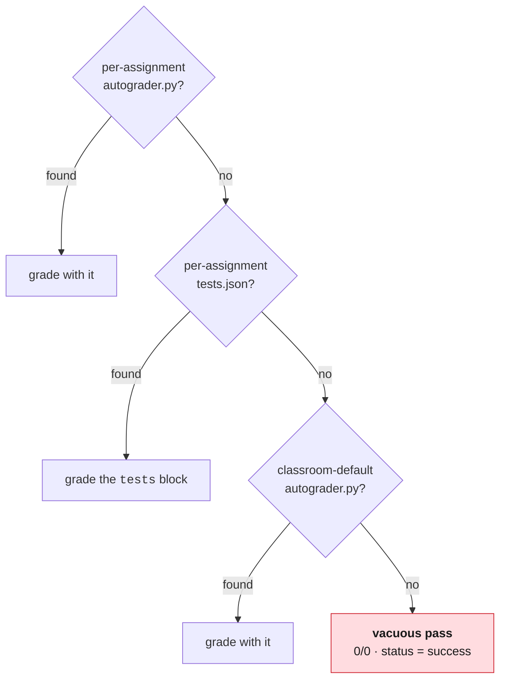

# CECS Golden Template — Python Project with Test Cases

A starting point for a CECS course assignment: a small Python package under
`src/`, a matching `pytest` suite under `tests/`, CI that runs on every push,
and a Verification Log the student fills in.

Replace the sample `stats` exercise with your own content. Keep the shape: the
autograder and the CI both depend on it.

> [!NOTE]
> Files in this repo carry `FACULTY:` comments explaining why each piece is the
> way it is. They are written for whoever adapts this next. Students can ignore
> them, and you can strip them once your own version settles.

## Start here

Never set up an autograder before? Start with the
**[Web UI](docs/getting-started-web.md)** or
**[CLI](docs/getting-started.md)** getting-started guide. Both go from zero to
a verified working assignment and assume no prior experience.

| Guide | For |
|---|---|
| [Getting started with the Web UI](docs/getting-started-web.md) | First-time setup in the browser, end to end |
| [Getting started with the CLI](docs/getting-started.md) | The same path using `gh teacher` and `gh student` |
| [Writing tests with the Web UI](docs/writing-tests-web.md) | Test types, weighting, and traps in the assignment form |
| [Writing tests with the CLI](docs/writing-tests.md) | The same grading model using `gh teacher` and JSON specs |
| [Troubleshooting](docs/troubleshooting.md) | Symptom → diagnosis → fix |
| [Performance sanity check](perf/README.md) | Load testing: when to enable it, and what it does not test |
| [Governance](docs/governance.md) | The recommended baseline (advisory, not mandatory), and what is entirely yours |

The rest of this README is about this repository: its layout, its CI, and what
to change when you make it your own.

## Layout

| Path | What goes here |
|---|---|
| `src/` | Starter code students complete. Importable as a package. |
| `tests/` | `pytest` suite. The autograder runs this same suite. |
| `docs/` | Assignment instructions for students. |
| `VERIFICATION-LOG.md` | Required. The student's record of AI assistance. |
| `.github/workflows/ci.yml` | Runs the suite on every push, so students see pass/fail without waiting on a grade. Two modes; see below. |
| `perf/` | Performance sanity check. 75 concurrent users, latency and error-rate thresholds. **Opt-in**; see [perf/README.md](perf/README.md). |
| `.github/workflows/core-standard.yml` | Advisory self-check against the recommended [baseline](docs/governance.md). Reports; never fails your build. |
| `LICENSE` | MIT. Fork it, adapt it, teach with it. |

---

## For students

```bash
python3 -m pip install -r requirements.txt
python3 -m pytest -q
```

Implement the functions in `src/`, run the tests locally until they pass, then
commit and push. CI runs the same suite. Fill in `VERIFICATION-LOG.md` before
your final push. It is part of the grade.

---

## For instructors

### The one failure mode that will bite you

> [!CAUTION]
> **An assignment with no `tests` block grades everything as a pass.**

The runner resolves a grading entrypoint in this order:



That last step is not an error state. It is a deliberate "no autograder
configured yet" path that returns **0/0, status success**. It looks green in every
UI, and an empty submission gets the same result as a correct one.

This is exactly how this template was found broken: it pointed at a repo with
no code and had no `tests` block, so every push came back green and nothing
anywhere said otherwise.

> [!IMPORTANT]
> **Once per assignment, before students see it:** push one deliberately wrong
> submission and confirm it comes back **red**. A green run proves nothing. It is
> what a completely unconfigured assignment also produces. Only a red run proves
> the grader is wired up.

### Two things must stay in sync

1. **`tests/` must contain real tests.** An empty suite reports success.
2. **The assignment's `tests` block must match this layout.** It lives in the
   classroom config repo's `assignments.json`, not here. For this template:

   ```json
   "tests": [
     { "name": "module imports", "type": "run",
       "run": "python3 -c \"import src.stats\"", "points": 1 },
     { "name": "pytest suite", "type": "python",
       "setup": "python3 -m pip install --quiet -r requirements.txt",
       "run": "python3 -m pytest -q tests/test_stats.py",
       "timeout": 120, "points": 12 }
   ]
   ```

   The import smoke test is worth its one point: when a student breaks the
   import, it names that directly instead of reporting twelve confusing
   downstream errors.

### Why CI is green here but red in a student copy

The starter is unimplemented on purpose: every stub raises. Running the full
suite in *this* repo would fail 12/12 and paint the template with a red X. That
is a poor first impression for something meant to be copied, and worse, it
trains people to ignore a red badge.

So `ci.yml` has two modes, keyed on the repo's `is_template` flag rather than a
hardcoded name, so a fork into a new course keeps working untouched:

| Repo | What CI asserts |
|---|---|
| **Template** (this one) | The suite collects: imports cleanly and yields `EXPECTED_CASES` cases. That is the real check for scaffolding. It catches a broken import, a renamed module, or a test lost to a duplicate name, none of which need a solution to detect. |
| **Student copy** | Full suite, real pass/fail. Red is the point. |

If you change the number of test cases, update `EXPECTED_CASES` in `ci.yml`.

Detection defaults to *student* mode when `is_template` is absent from the
event payload. That direction is deliberate. The worst case is a template
showing red, never a student repo silently skipping its tests.

### Adapting this to your course

Work outward from the middle:

1. Rewrite `src/` with your exercise. Stubs must raise, not `pass`.
2. Rewrite `tests/` to match. Case count is your weighting (see the notes in
   that file).
3. Rewrite `docs/assignment.md`.
4. Update the `run` paths in the `tests` block above if you rename anything.
5. Push a wrong submission. Confirm red.

Steps 1–4 are the visible work. Step 5 is the one that actually protects you,
and it is the one people skip.

### Scope note

Python is the sample, not a requirement. A Node version is the same structure
with `npm test` in place of `pytest`; the `tests` block takes any command. The
grading contract is "a command that exits non-zero on failure," not a language.

---

## License

[MIT](LICENSE). Fork it, adapt it, teach with it, ship it in your own
organization. The [recommended baseline](docs/governance.md) is a
recommendation for CECS courses, not a license restriction and not a
requirement. Take what is useful and ignore the rest.
