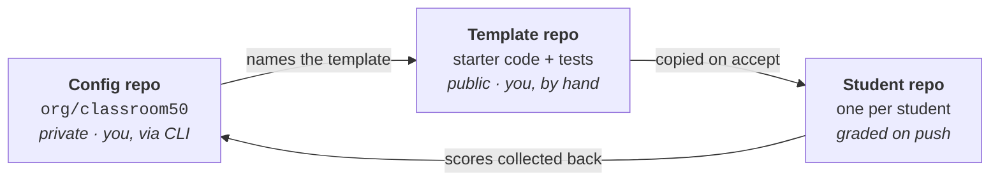

# Getting started with the CLI — your first autograded assignment

For faculty who have never set up an autograder. No prior GitHub Classroom
experience assumed. Budget about 45 minutes the first time; subsequent
assignments take five.

By the end you will have a real assignment that students can accept, and you
will have **proved** it grades correctly rather than assumed it.

> [!TIP]
> Prefer the browser? Use [Getting started with the Web UI](getting-started-web.md).
>
> Already know Classroom 50? You want the
> [CLI Teacher Guide](https://github.com/foundation50/classroom50/wiki/CLI-Teacher-Guide)
> instead. This is the ground-up version.

---

## What you are actually building

Three moving parts. The confusion beginners hit is not knowing which is which.



| Part | What it is | Who touches it |
|---|---|---|
| **Config repo** | `<org>/classroom50`. Holds the roster, the assignment list, and the rules for grading. Created for you by `gh teacher init`. | You, via CLI |
| **Template repo** | An ordinary repo with starter code and tests, flagged as a GitHub template. | You, by hand |
| **Student repo** | A copy made when a student accepts. Graded automatically on push. | The student |

> [!WARNING]
> **The most common beginner misconception:** that putting tests in the template
> is enough. It isn't. The template holds the test *files*; the config repo holds
> the instruction to *run* them. Miss the second and everything silently passes.
> See [step 7](#step-7--prove-it-actually-grades).

---

## Before you start

You need:

- The [GitHub CLI](https://cli.github.com/) (`gh`)
- A GitHub **organization** you own or administer
- Admin rights on it

Install the extensions:

```sh
gh extension install foundation50/gh-teacher
gh extension install foundation50/gh-student
gh teacher login
```

`gh teacher login` requests the scopes these commands need (`admin:org`,
`read:org`, `repo`, `workflow`). Install `gh-student` too; you will use it in
step 7 to verify your own assignment the way a student experiences it.

> [!NOTE]
> **Already done for `Giacalone-CECS`.** Working in our org? Skip to
> [step 3](#step-3--add-a-classroom). It is initialized and the config repo
> already exists.

---

## Step 1 — Initialize the organization

Once per organization, ever.

```sh
gh teacher init --dry-run <org>     # read-only preflight; run this first
gh teacher init <org>               # for real
```

This creates `<org>/classroom50` (private), commits the grading workflows,
enables Pages, and applies a least-privilege lockdown of org member
permissions.

It prompts for a **service token**, a fine-grained PAT used by the
score-collection workflow. Create it at **Settings → Developer settings →
Personal access tokens → Fine-grained tokens**.

> [!IMPORTANT]
> Set **Resource owner** to the **organization**, not your personal account.
> This is the single dropdown people get wrong. A personally-owned token cannot
> see org repos, and score collection fails much later with a confusing
> permissions error.

`init` is idempotent. Re-run it any time.

---

## Step 2 — Build a template repo

This is the assignment content. Make an ordinary repo containing:

```
src/            starter code, functions unimplemented
tests/          the test suite
docs/           instructions for students
README.md
```

Then flag it: **Settings → Template repository → ✓**.

Two rules that will save you an afternoon:

1. **Stubs must `raise`, not `pass`.** A `pass` stub returns `None`, so "hasn't
   started" and "got it wrong" look identical in the gradebook.
2. **Visibility.** Public always works. Private works only if it is *inside*
   your organization. A private template outside the org is rejected.

**Don't build one from scratch the first time.** Use **this repository**: hit
*Use this template* on
[cecs-golden-template-python](https://github.com/Giacalone-CECS/cecs-golden-template-python).
It has the layout, a working suite, CI, and a Verification Log, and every file
carries `FACULTY:` comments explaining why it's shaped that way. See
[the repo README](../README.md) for what to keep and what to change.

---

## Step 3 — Add a classroom

A classroom is one course section for one term.

```sh
gh teacher classroom add <org> <short-name> --name "<full name>" --term <term>
```

Real example:

```sh
gh teacher classroom add Giacalone-CECS cecs-378-fa26 \
    --name "CECS 378 — Fall 2026" --term Fall-2026
```

The short name must be lowercase letters, digits, and hyphens (2–39 chars). It
becomes part of every student repo name (`<short-name>-<assignment>-<username>`),
so pick something you will still want to read in six months.

> [!TIP]
> **Coming from GitHub Classroom?** `gh teacher classroom migrate --source <id-or-org>
> --target <org>` copies your starter repos over and creates the classroom in one
> step. Rosters and scores do **not** migrate. Pass `--dry-run` first.

---

## Step 4 — Add students

```sh
gh teacher roster add <org> <classroom> <username> \
    --first-name Alice --last-name Chen --email achen@student.csulb.edu
```

Or bulk, with a CSV headed `username,first_name,last_name,email,section`:

```sh
gh teacher roster import <org> <classroom> roster.csv
```

`roster add` does three things at once: records the student, sends the org
invite, and adds them to the classroom team so they can read in-org private
templates. Re-running is safe.

You can do this last; it doesn't block the steps below.

---

## Step 5 — Register the assignment

```sh
gh teacher assignment add <org> <classroom> <slug> \
    --name "<display name>" --template <owner>/<repo>
```

Real example:

```sh
gh teacher assignment add Giacalone-CECS cecs-378-fa26 lab-01-stats \
    --name "Lab 1 — Descriptive Statistics" \
    --template Giacalone-CECS/cecs-golden-template-python \
    --due 2026-09-15T23:59:00-07:00
```

Optional flags worth knowing, none of them required:

| Flag | What it does |
|---|---|
| `--due` | Due date. Stored as UTC; omit the offset and your local zone is assumed. |
| `--available-from` | Hides the assignment from the student list until the date passes. |
| `--submission-mode tag` | Only `submit/*` tag pushes grade. A plain `git push` costs no Actions minutes, which matters for large sections. Default is `every-push`. |
| `--pass-threshold` | Advisory passing bar as a percentage. Display only; it does not change scores. |
| `--tests` | Set the whole declarative test block from a JSON file instead of adding tests one at a time. |

The full list is in the
[CLI Teacher Guide](https://github.com/foundation50/classroom50/wiki/CLI-Teacher-Guide).

> [!CAUTION]
> **The assignment now exists and grades nothing.** That is not a bug you can
> see. It is the default state, and it reports *success*. Step 6 is what makes
> grading real.

---

## Step 6 — Tell it how to grade

This is the step that does not exist in GitHub Classroom's mental model, and
the step beginners skip.

```sh
gh teacher assignment test add <org> <classroom> <slug> \
    --name "module imports" --type run \
    --run 'python3 -c "import src.stats"' --points 1

gh teacher assignment test add <org> <classroom> <slug> \
    --name "pytest suite" --type python \
    --setup "python3 -m pip install --quiet -r requirements.txt" \
    --run "python3 -m pytest -q tests/test_stats.py" \
    --timeout 120 --points 12
```

Check it landed:

```sh
gh teacher assignment test list <org> <classroom> <slug>
```

Two tests, 13 points. The suite's 12 points are **split across its cases**
automatically: 9 of 12 passing scores 9. The 1-point import test exists so
that a broken import is reported as "your module doesn't import" instead of
twelve confusing downstream errors.

Full detail on test types and weighting:
**[Writing tests with the CLI](writing-tests.md)**.

---

## Step 7 — Prove it actually grades

> [!CAUTION]
> **Do not skip this step.** It is the only one that distinguishes a working
> autograder from a broken one.

An assignment with no tests configured returns **0/0, status success**: green in
every UI, on every submission, including an empty one. So "I pushed and it
passed" is not evidence of anything. Only a **failing** run is.

Accept your own assignment as a student would:

```sh
gh student accept <org> <classroom> <slug>
```

Clone the repo it prints, then **deliberately break something**: delete a
function body, or leave the starter untouched, since the stubs already raise.

```sh
git commit -am "deliberately wrong" && git push
```

Watch the Actions tab.

| What you see | What it means |
|---|---|
| ❌ **Red, with named failing tests** | ✅ Working. Ship it. |
| ✅ Green, score `0/0` | ❌ Your `tests` block never landed. Redo step 6. |
| ✅ Green with real points | ❌ Your "wrong" submission wasn't wrong. Break it harder. |

Now fix the code and push again to confirm it goes green for the right reason.
Then delete the test repo.

Once it fails correctly and passes correctly, you are done. Everything after
this is repetition.

---

## Step 8 — Collect scores

Scores land in `<classroom>/scores.json` in the config repo, gathered by the
**Collect Scores** workflow on a schedule. Run it early to confirm the service
token works:

```sh
gh workflow run "Collect Scores" -R <org>/classroom50
gh run list -R <org>/classroom50 -w "Collect Scores" -L 1
```

A permissions failure here almost always means the service token's **resource
owner** is your personal account instead of the organization. Regenerate it
with the org selected and re-run `gh teacher init`.

---

## What to read next

| You want to | Read |
|---|---|
| Write more interesting tests | [Writing tests with the CLI](writing-tests.md) |
| Diagnose something broken | [Troubleshooting](troubleshooting.md) |
| Adapt this template to your course | [Template README](../README.md) |
| Look up a `gh teacher` command | [CLI Teacher Guide](https://github.com/foundation50/classroom50/wiki/CLI-Teacher-Guide) |
| Grade something declarative tests can't express | [Autograders wiki](https://github.com/foundation50/classroom50/wiki/Autograders) |
